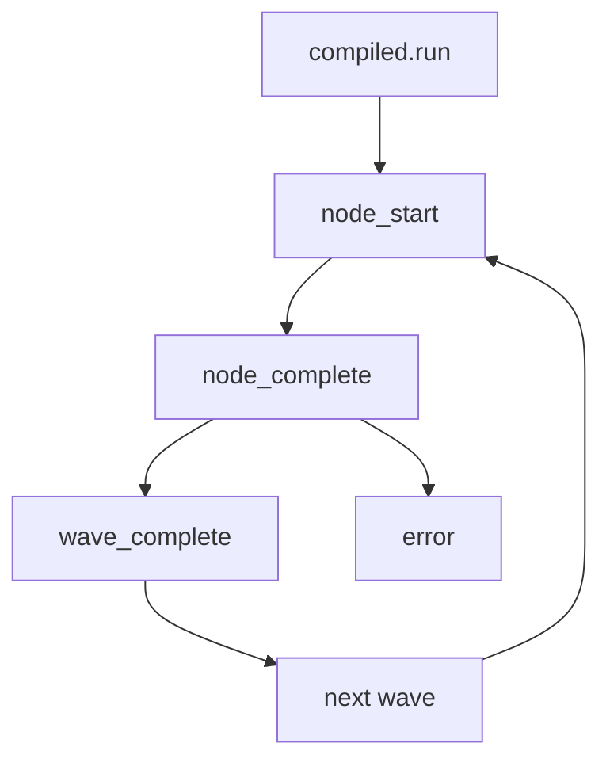
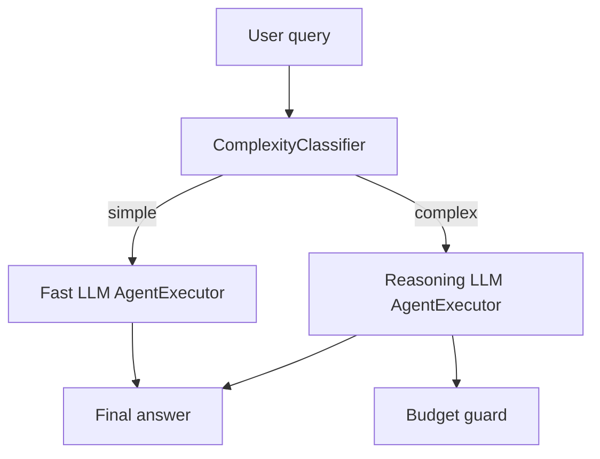
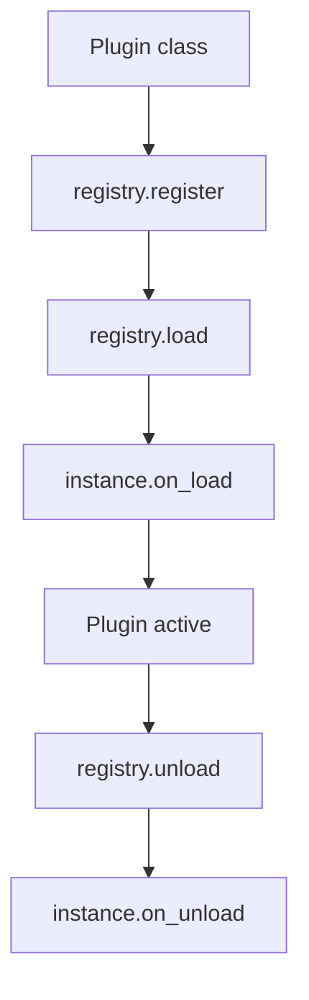

# Architecture Deep Dive

SynapseKit is intentionally small on the surface, but there is real machinery underneath.
This page is a long-form tour of how the core pieces fit together and where to extend them.
It is aimed at power users and contributors who want to understand execution flow, not just APIs.

If you only need the high-level overview, read the shorter Architecture page first.
This deep dive assumes you already know the basic concepts (RAG, agents, graphs).

## Reading map (use this to skip around)

- If you care about event loops and sync wrappers: see Async runtime model.
- If you are building RAG pipelines: see RAG internals and Retrieval flow.
- If you want graph pipelines: see Graph engine internals.
- If you build agents: see Agent loop internals and ReasoningAgent routing.
- If you want extensions: see Plugins and Extension points.

---

## 1) Layer model recap

SynapseKit is structured as a set of loosely-coupled layers you can use independently.
The layer diagram remains the simplest mental model:


Key idea: layers are composable but not forced.
You can use a single LLM provider without agents, or a graph without RAG, or RAG without graphs.
Most modules are designed to be swappable behind clear interfaces.

### Layer-by-layer quick guide (minimal)

- LLM layer: provider-agnostic generation, streaming, and tool calls
- Retrieval layer: vector stores, retrievers, rerankers
- RAG layer: orchestration of retrieval + generation + memory
- Agent layer: tool loops over LLMs
- Graph layer: stateful DAG execution and checkpoints
- Observability layer: spans, metrics, evaluation

This mental model helps decide where to extend: pick the smallest layer that solves your problem.

---

## 2) Core abstractions and contracts

This is the minimal set of types you should understand to reason about the system.
These are the core contracts that most features build on top of.

### BaseLLM

All providers implement a single async interface.
This is the “thin waist” of the LLM layer.

Key methods (simplified):

```python
class BaseLLM:
    async def generate(self, prompt: str, **kwargs) -> str: ...
    async def stream(self, prompt: str, **kwargs): ...
    async def call_with_tools(self, messages, tools, **kwargs) -> dict: ...
```

Where to read:
- src/synapsekit/llm/base.py
- docs/api/llm

### RAGPipeline

RAGPipeline orchestrates ingestion + retrieval + generation.
It owns a splitter, a retriever, a memory buffer, and tracing hooks.

Where to read:
- src/synapsekit/rag/pipeline.py
- docs/rag/pipeline

### StateGraph and CompiledGraph

StateGraph is a fluent builder for DAG workflows.
CompiledGraph is the executable form.

Where to read:
- src/synapsekit/graph/graph.py
- src/synapsekit/graph/compiled.py
- docs/graph/overview

### BaseAgent

Agents are tool-using loops on top of an LLM.
Two main flavors exist: ReAct and Function Calling.

Where to read:
- src/synapsekit/agents/react.py
- src/synapsekit/agents/function_calling.py
- docs/agents/overview

### TokenTracer

TokenTracer records token usage, latency, cost, and quality metrics.
It is the core of observability in most flows.

Where to read:
- src/synapsekit/observability/tracer.py
- docs/observability/overview

### PluginRegistry

Plugins are optional, user-defined hooks that can be loaded and unloaded.
The registry is a small but important extension point.

Where to read:
- src/synapsekit/plugins/registry.py
- src/synapsekit/plugins/loader.py
- docs/plugins

---

## 3) Async runtime model (and why sync wrappers exist)

SynapseKit is async-first. Every public API is async under the hood.
But the framework still supports sync entry points for notebooks and quick scripts.
This is handled via two small utilities:

- install_fast_loop(): tries to install uvloop if present
- run_sync(): runs a coroutine safely in both loop and no-loop contexts

Relevant code:
- src/synapsekit/_loop.py
- src/synapsekit/_compat.py

Key behavior:

1) On import, install_fast_loop() runs once.
2) run_sync() checks if a loop is already running.
3) If a loop is running (e.g., Jupyter), it uses a fresh thread and asyncio.run.
4) If no loop is running, it calls asyncio.run directly.

This avoids deadlocks when calling sync wrappers from a running loop.

Example (conceptual):

```python
def run_sync(coro):
    try:
        loop = asyncio.get_running_loop()
    except RuntimeError:
        loop = None
    if loop is running:
        # start new thread -> asyncio.run(coro)
    else:
        return asyncio.run(coro)
```

Mermaid view of the decision:

```mermaid
flowchart TD
    A[Sync wrapper called] --> B{Is event loop running?}
    B -- No --> C[asyncio.run(coro)] --> Z[Return result]
    B -- Yes --> D[ThreadPoolExecutor]
    D --> E[asyncio.run in new thread]
    E --> Z[Return result]
```

Best practice:
- Prefer async APIs in servers.
- Use sync wrappers only for scripts or notebooks.
- Never call sync wrappers from within a running asyncio loop in production servers.

---

## 4) RAG facade and ingestion flow

The RAG class is a convenience wrapper for the full pipeline.
It chooses defaults and wires together the main components.

Key initialization steps (from src/synapsekit/rag/facade.py):

1) Build the LLM via make_llm(model, api_key, provider, ...)
2) Build embeddings via SynapsekitEmbeddings
3) Build vector store via InMemoryVectorStore
4) Build Retriever using that vector store
5) Optionally build KnowledgeGraphBuilder + HybridKGRetriever
6) Build ConversationMemory
7) Build TokenTracer
8) Construct RAGPipeline with a RAGConfig

This is the “3-line happy path.”

### Provider auto-detection (factory)

The RAG facade calls make_llm(), which auto-detects provider from model name.
This is why “gpt-4o-mini” works without specifying provider.

Provider resolution (simplified):

- claude* -> anthropic
- gemini* -> gemini
- open-mistral* / mistral* -> mistral
- deepseek* -> deepseek
- moonshot* -> moonshot
- minimax* / abab* -> minimax
- glm* -> zhipu
- @cf/* or @hf/* -> cloudflare
- model contains “/” -> openrouter
- otherwise -> openai

Where to read:
- src/synapsekit/llm/_factory.py

### Multimodal ingestion

The facade detects file paths and routes to specific loaders:

- ImageLoader
- AudioLoader
- VideoLoader
- PDFLoader

If no file is detected, it falls back to plain text ingestion.

This means RAG.add() can accept both text and file paths.

### RAG facade quick guide (minimal)

1) Start with RAG(model, api_key)
2) Call add() for ingestion
3) Call ask_sync() for a quick answer
4) Use stream() for token streaming
5) Use RAGPipeline directly when you need custom components

---

## 5) RAGPipeline internals (ingest -> retrieve -> answer)

RAGPipeline owns the concrete flow and the safety logic.
Some key points:

- Uses a splitter (RecursiveCharacterTextSplitter) unless retriever overrides add_document.
- Skips empty or whitespace-only chunks.
- Supports metadata propagation on ingestion.
- Tracks auto-eval tasks and async evaluation tasks.

### Data flow diagram


### Query path (simplified)

1) start_span("rag.ask")
2) start_span("rag.retrieve")
3) call retriever.retrieve or retriever.retrieve_with_scores
4) optional context packer
5) end_span("rag.retrieve") with chunk count and top score
6) build prompt (system prompt + memory + context)
7) call LLM stream/generate
8) update memory
9) end_span("rag.ask")

You can see the span calls in src/synapsekit/rag/pipeline.py.
This is why the tracing layer can show retrieval latency separately from model latency.

---

## 6) Retrieval and ranking pipeline

Retrieval is intentionally modular.
The core Retriever is thin and delegates to vector store backends.
Advanced strategies live under src/synapsekit/retrieval.

### Base Retriever flow (step-by-step)

This is the default path used when no advanced strategy overrides it.

1) fetch_k is calculated as top_k (or top_k * 3 when rerank is enabled)
2) VectorStore.search() returns candidate chunks + metadata
3) Optional BM25 rerank narrows results back down to top_k
4) Results are returned to RAGPipeline for prompt assembly

The base retriever emits a reranker span when BM25 is used:

- reranker.rerank (attributes: type, top_k, candidates)

Where to read:
- src/synapsekit/retrieval/retriever.py

### MMR and diversity

Retriever.retrieve_mmr() delegates to VectorStore.search_mmr().
This is a diversity-focused retrieval strategy used by some advanced flows.

Where to read:
- src/synapsekit/retrieval/retriever.py (retrieve_mmr)
- src/synapsekit/retrieval/vectorstore.py (search_mmr)

### Strategy modules (examples)

- rag_fusion.py (RAG Fusion)
- self_rag.py (self-rag)
- query_decomposition.py
- adaptive.py
- kg/* (knowledge graph retrieval)
- federated.py (fan-out to multiple retrievers)
- parent_document.py (parent document retrieval)
- sentence_window.py (windowed retrieval)

These are opt-in strategies that build on the same Retriever/VectorStore contracts.

### VectorStore extension point

VectorStore implementations live under:

- src/synapsekit/retrieval/*.py

Each backend implements add(), search(), search_mmr(), save(), load().
The interface is intentionally small so new backends are easy to add.

### Advanced reranking

- BM25 rerank is built-in (rank-bm25)
- Cross-encoder and other rerankers live in retrieval/* modules

### Ingestion override rule (important)

If Retriever implements add_document explicitly, RAGPipeline defers chunking to it.
This allows advanced retrievers to control their own ingest behavior.

---

## 7) Graph engine internals

The graph engine is built around a fluent builder and a compiled executor.
The builder is StateGraph; the compiled form is CompiledGraph.

### Builder behavior (StateGraph)

- add_node(name, fn)
- add_edge(src, dst)
- add_conditional_edge(src, condition_fn, mapping)
- set_entry_point(name)
- compile()

Validation happens in compile(), which calls _validate().
If entry point is missing or invalid, GraphConfigError is raised.

Where to read:
- src/synapsekit/graph/graph.py
- src/synapsekit/graph/edge.py
- src/synapsekit/graph/node.py
- src/synapsekit/graph/errors.py

### Execution overview


### CompiledGraph execution model (more detail)

CompiledGraph pre-builds an adjacency map for O(1) edge lookup per node.
Execution happens in waves; nodes in the same wave can run concurrently.

Key internal details:

- _adj is built once in __init__ for fast edge traversal
- max_steps defaults to 100 to prevent infinite cycles
- state is copied at the start of run()
- transient keys are injected into state for subgraphs and stripped later

Relevant transient keys:

- __checkpointer__
- __graph_id__
- __step__

Where to read:
- src/synapsekit/graph/compiled.py

### Graph events and streaming

Graph execution emits typed events via EventHooks.
These can be used for SSE and WebSocket streaming.

Key event types:

- node_start
- node_complete
- wave_start
- wave_complete
- error

Where to read:
- src/synapsekit/graph/streaming.py
- docs/graph/mermaid

Mermaid view of graph event flow:



### ExecutionTrace and GraphVisualizer

ExecutionTrace records all events with timestamps and duration.
GraphVisualizer renders the trace in three formats:

- ASCII timeline
- Mermaid diagram (optionally trace-highlighted)
- Standalone HTML with embedded Mermaid

Where to read:
- src/synapsekit/graph/trace.py
- src/synapsekit/graph/visualization.py

### Checkpointing

Checkpointers are pluggable storage backends.
Built-ins include memory, SQLite, Redis, Postgres, and JSON file checkpointers.

Where to read:
- src/synapsekit/graph/checkpointers/*
- docs/graph/checkpointing

### Graph how-to quick guide (minimal)

1) Build your StateGraph with clear node names.
2) Use TypedState when you need reducers or structured state.
3) Use EventHooks for logging and debugging.
4) Use ExecutionTrace when you need post-mortem analysis.
5) Use checkpointers for resumable workflows.

---

## 8) Agent loop internals (ReAct and Function Calling)

### ReActAgent (tool loop)

ReActAgent uses a strict prompt format and a scratchpad.
It parses “Thought / Action / Action Input” blocks, executes tools, and continues.

Key components:
- ToolRegistry (tool schemas)
- AgentScratchpad (history of steps)
- _parse_action / _parse_final_answer helpers
- AgentMemory (optional persistent memory)

Where to read:
- src/synapsekit/agents/react.py
- src/synapsekit/agents/memory.py
- src/synapsekit/agents/registry.py

### FunctionCallingAgent

Function calling relies on provider-native tool call APIs.
The agent selects tools via structured tool call payloads rather than text parsing.
This eliminates brittle string parsing and makes tool schemas first-class.

Where to read:
- src/synapsekit/agents/function_calling.py

### Agent loop step-by-step (ReAct)

The ReAct flow is deterministic at a high level:

1) Build system + user messages (including scratchpad)
2) LLM returns Thought / Action / Action Input
3) Tool is resolved via ToolRegistry
4) Tool is executed and Observation appended
5) Scratchpad is updated
6) Repeat until Final Answer

If a tool name is unknown, the agent raises an error rather than guessing.
This is intentional to prevent hallucinated tool calls.

### ReasoningAgent routing

ReasoningAgent wraps a fast LLM and a reasoning LLM.
It routes based on a ComplexityClassifier.

Key features:
- LLM-based classification if classifier_llm is provided
- Heuristic fallback (length, keywords, question count)
- Budgeted reasoning LLM wrapper with thinking token limits

Where to read:
- src/synapsekit/agents/reasoning_agent.py

Mermaid view of the routing logic:



---

## 9) Observability and evaluation pipeline

Observability is a combination of spans + token tracing.
It is implemented by a small runtime that manages spans, exporters, and sampling.

Key pieces:

- TokenTracer: records tokens, latency, cost, and quality metrics
- observe.runtime: start_span / end_span / record_exception
- RAGEvaluator: optional async evaluation of RAG quality
- PrometheusMetrics: optional metrics exporter

Where to read:
- src/synapsekit/observability/tracer.py
- src/synapsekit/observe/runtime.py
- src/synapsekit/observability/metrics.py
- src/synapsekit/evaluation/rag_evaluator.py
- docs/observability/overview
- docs/evalci/overview

### Observe runtime internals

Observe uses a global _STATE and a ContextVar to track the current span.
It supports multiple exporters (console, OTLP, Jaeger, Langfuse, Honeycomb).
Sampling is controlled by ObserveConfig.sample_rate.
Sensitive keys can be redacted with ObserveConfig.redact_keys.

This is intentionally simple so instrumentation has low overhead.

### Metrics pipeline (Prometheus)

PrometheusMetrics can record:

- synapsekit_cost_usd_total
- synapsekit_tokens_total
- synapsekit_latency_seconds

These metrics are emitted when the llm.generate span is recorded.
If you enable metrics, they attach to observe runtime and are updated per span.

### How traces flow

For example, RAGPipeline.stream() emits:

- rag.ask
- rag.retrieve
- rag.generate (inside LLM call)

Agent loops emit:

- agent.run
- agent.step
- agent.final_answer

Graph flows emit:

- graph.run
- graph.wave
- graph.node

These spans are deliberately named so dashboards can aggregate across features.

### Observability quick guide (minimal)

1) Call observe.configure() early in your app
2) Choose an exporter (console, otlp, jaeger, langfuse)
3) Optionally enable PrometheusMetrics
4) Verify spans by checking exporter output

---

## 10) Plugins and extension hooks

The plugin system is intentionally small but fully async.

Key classes:

- BasePlugin: subclass with a name, optional on_load / on_unload
- PluginRegistry: register, load, unload, list, get
- load_plugin_from_path: dynamic import + registration

Where to read:
- src/synapsekit/plugins/base.py
- src/synapsekit/plugins/registry.py
- src/synapsekit/plugins/loader.py
- docs/plugins

Mermaid view of plugin lifecycle:



This design keeps plugins explicit and predictable.
There is no hidden global auto-loading unless you call it.

---

## 11) API stability markers (public_api / experimental / deprecated)

SynapseKit uses lightweight decorators to mark API stability.
These do not change runtime behavior, but they attach metadata and warnings.

Where to read:
- src/synapsekit/_api.py

Summary:
- public_api: marks stable interfaces
- experimental: warns on first use
- deprecated: warns with a reason and alternative

Why this matters:
- You can build tooling to detect experimental APIs via attributes
- You can surface deprecations in your own docs or CLI

This is helpful when deciding what to depend on.

---

## 12) Optional dependencies and lazy imports

SynapseKit intentionally has only two hard dependencies.
Everything else is opt-in and imported lazily.

Common extras:

- synapsekit[openai]
- synapsekit[chroma]
- synapsekit[redis]
- synapsekit[postgres]
- synapsekit[performance]
- synapsekit[all]

Lazy import behavior:

- Optional modules are imported inside methods, not at module import time.
- If an extra is missing, you get an ImportError only when you use that feature.

This keeps core installs small while still allowing advanced features.

---

## 13) Extension points (where to hook in)

This section is intentionally practical.
It lists the actual files you touch and the typical sequence.

### Add a new LLM provider (guide)

Minimal steps:

1) Create src/synapsekit/llm/<provider>.py and implement BaseLLM
2) Wire it into the factory (src/synapsekit/llm/_factory.py)
3) Add optional dependency in pyproject.toml extras
4) Add tests under tests/llm
5) Add docs under synapsekit-docs/docs/llms/<provider>.md

Key file: src/synapsekit/llm/_factory.py (provider auto-detection)

Tip: provider auto-detection is done by model name prefix.
If your models follow a unique prefix, add it there.

### Add a vector store (guide)

Minimal steps:

1) Create src/synapsekit/retrieval/<backend>.py
2) Implement VectorStore.add/search/search_mmr/save/load
3) Add optional dependency in pyproject.toml extras
4) Add tests under tests/retrieval
5) Add docs under docs/rag/vector-stores or docs/api/vector-store

Tip: keep VectorStore small and let Retriever own reranking.

### Add a tool (guide)

Minimal steps:

1) Implement BaseTool under src/synapsekit/agents/tools
2) Export in src/synapsekit/agents/__init__.py
3) Re-export in src/synapsekit/__init__.py
4) Add tests under tests/agents or tests/tools
5) Add docs under docs/agents/tools or docs/guides/agents

Tip: keep tools pure and side-effect free when possible.

### Add a graph node type (guide)

1) Implement a node function that accepts and returns dict state
2) Register it with StateGraph.add_node()
3) If it needs metadata, attach metadata on `add_node(..., metadata={...})`
4) Use TypedState when merging needs reducers

Tip: use EventHooks to debug node ordering.

### Add a plugin (guide)

1) Subclass BasePlugin and define name
2) Register with PluginRegistry.register()
3) Optionally load dynamically via load_plugin_from_path()
4) Use on_load/on_unload for async setup/teardown

These extension points are deliberately explicit and documented.

---

## 14) Common pitfalls (and how to avoid them)

- Mixing sync wrappers inside a running asyncio loop.
  Use the async APIs in servers and long-running apps.

- Assuming retriever.add_document will be called.
  If you override Retriever, ensure it handles ingestion explicitly.

- Forgetting to pass metadata on ingestion.
  Metadata powers source tracing, filtering, and evaluation.

- Overusing global state for tools or agents.
  Prefer dependency injection when possible.

- Ignoring TokenTracer and spans.
  Observability makes debugging much faster in production.

- Building graphs without setting an entry point.
  GraphConfigError is raised; set_entry_point() before compile().

- Calling graph streaming without attaching hooks.
  If you want events, pass EventHooks or use sse_stream/ws_stream.

- Returning non-dict state from graph nodes.
  StateGraph expects dict state updates or reducers.

---

## 15) Suggested next reads

- Graph Workflows overview: /docs/graph/overview
- RAG pipeline details: /docs/rag/pipeline
- Agent system overview: /docs/agents/overview
- Observability overview: /docs/observability/overview
- API reference: /docs/api/llm

---

## 16) Quick mental model (one paragraph)

Think of SynapseKit as a thin, async-first core with small but explicit contracts.
RAGPipeline and StateGraph are orchestration layers built on BaseLLM and VectorStore.
Agents are loops over those same contracts, with tool execution layered on top.
Observability and evaluation are cross-cutting concerns that instrument the flow.
Plugins and optional extras keep the system extensible without bloating the base install.
