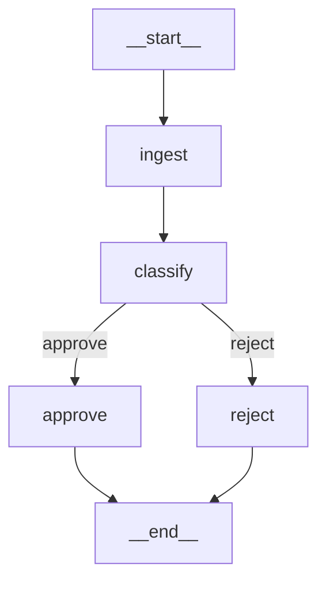
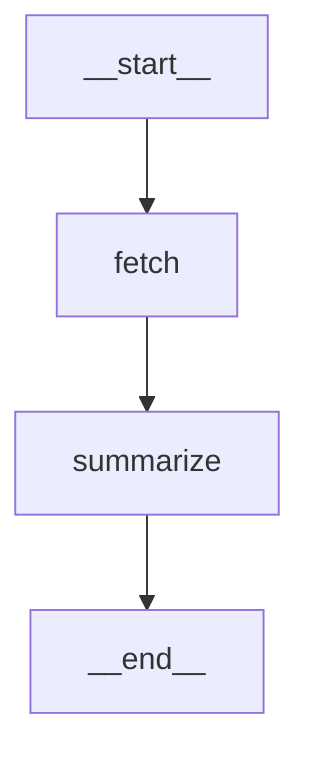

# Mermaid Export

`CompiledGraph.get_mermaid()` returns a [Mermaid](https://mermaid.js.org/) flowchart string for your graph. Use it to visualize pipelines in Markdown, Notion, GitHub, or Jupyter.

## Usage

```python
graph = (
    StateGraph()
    .add_node("ingest", ingest)
    .add_node("classify", classify)
    .add_node("approve", approve)
    .add_node("reject", reject)
    .add_edge("ingest", "classify")
    .add_conditional_edge("classify", route, {"approve": "approve", "reject": "reject"})
    .add_edge("approve", END)
    .add_edge("reject", END)
    .set_entry_point("ingest")
    .compile()
)

print(graph.get_mermaid())
```

Output:

```
flowchart TD
    __start__ --> ingest
    ingest --> classify
    classify -->|approve| approve
    classify -->|reject| reject
    approve --> __end__
    reject --> __end__
```

Which renders as:



## Rendering in Jupyter

```python
from IPython.display import display, Markdown

mermaid = graph.get_mermaid()
display(Markdown(f"```mermaid\n{mermaid}\n```"))
```

## Rendering in GitHub

Paste the output into any GitHub Markdown file inside a fenced code block:

````

````

GitHub renders Mermaid diagrams natively.

## Notes

- The entry point renders as `__start__ --> <entry_node>`
- `END` renders as `__end__`
- Conditional edge labels come from the `mapping` keys
- Only static structure is reflected — conditional routing is shown as all possible branches
