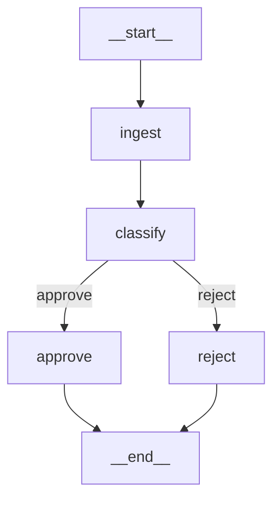
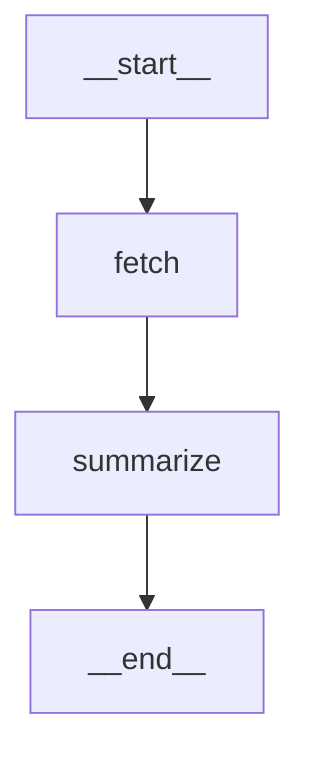

# Mermaid Export

`CompiledGraph.get_mermaid()` returns a [Mermaid](https://mermaid.js.org/) flowchart string for your graph. Use it to visualize pipelines in Markdown, Notion, GitHub, or Jupyter.

## Usage

```python
graph = (
    StateGraph()
    .add_node("ingest", ingest)
    .add_node("classify", classify)
    .add_node("approve", approve)
    .add_node("reject", reject)
    .add_edge("ingest", "classify")
    .add_conditional_edge("classify", route, {"approve": "approve", "reject": "reject"})
    .add_edge("approve", END)
    .add_edge("reject", END)
    .set_entry_point("ingest")
    .compile()
)

print(graph.get_mermaid())
```

Output:

```
flowchart TD
    __start__ --> ingest
    ingest --> classify
    classify -->|approve| approve
    classify -->|reject| reject
    approve --> __end__
    reject --> __end__
```

Which renders as:



## Rendering in Jupyter

```python
from IPython.display import display, Markdown

mermaid = graph.get_mermaid()
display(Markdown(f"```mermaid\n{mermaid}\n```"))
```

## Rendering in GitHub

Paste the output into any GitHub Markdown file inside a fenced code block:

````

````

GitHub renders Mermaid diagrams natively.

## Notes

- The entry point renders as `__start__ --> <entry_node>`
- `END` renders as `__end__`
- Conditional edge labels come from the `mapping` keys
- Only static structure is reflected — conditional routing is shown as all possible branches

## Trace-highlighted Mermaid

`get_mermaid_with_trace()` generates a Mermaid diagram with CSS classes showing execution status — useful for debugging failed graph runs.

```python
from synapsekit import StateGraph, ExecutionTrace, EventHooks

trace = ExecutionTrace()
hooks = trace.hook(EventHooks())
result = await compiled.run(state, hooks=hooks)

from synapsekit.graph.mermaid import get_mermaid_with_trace
print(get_mermaid_with_trace(graph, trace))
```

Nodes are styled with:
- **completed** (green) — node finished successfully
- **errored** (red) — node encountered an error
- **skipped** (gray) — node was not executed

## GraphVisualizer

`GraphVisualizer` provides a higher-level visualization API with multiple output formats.

```python
from synapsekit import GraphVisualizer

viz = GraphVisualizer(compiled)

# ASCII timeline with wave grouping
print(viz.render_trace(trace))
# Wave 1:
#   [ingest] 12.3ms
# Wave 2:
#   [classify] 8.1ms
# Total: 20.4ms

# Step-by-step replay
for step in viz.replay_steps(trace):
    print(step["node"], step["duration_ms"], step["status"])

# Standalone HTML with embedded Mermaid
html = viz.to_html(trace)
with open("graph.html", "w") as f:
    f.write(html)
```

### Methods

| Method | Description |
|---|---|
| `render_trace(trace)` | ASCII timeline with wave grouping and durations |
| `render_mermaid(trace=None)` | Static or trace-highlighted Mermaid diagram |
| `replay_steps(trace)` | List of step dicts with node, duration, wave, status |
| `to_html(trace=None)` | Standalone HTML with embedded Mermaid JS |
