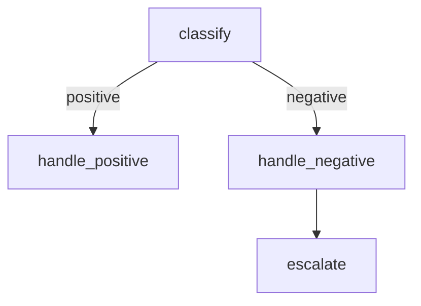

import ColabBadge from '@site/src/components/ColabBadge';

# Visualizing Graphs with Mermaid

<ColabBadge path="graph/mermaid-visualization.ipynb" />

A graph you cannot see is a graph you cannot debug. SynapseKit can render any compiled `StateGraph` as a Mermaid flowchart — a plain-text diagram format supported by GitHub, Notion, Confluence, and dozens of other tools. You can also export PNG images directly from Python.

**What you'll build:** A visualization toolkit that renders a multi-branch graph as a Mermaid string, highlights the active execution thread, embeds it in a Docusaurus doc, and exports a PNG image. **Time:** ~10 min. **Difficulty:** Beginner

## Prerequisites

```bash
pip install synapsekit[openai,graph]
# Optional: for PNG export
pip install matplotlib
```

## What you'll learn

- Call `get_mermaid()` on a compiled graph to get the diagram string
- Use `to_mermaid(highlight_thread=)` to highlight a specific run's execution path
- Use `GraphVisualizer` for rich rendering and PNG export
- Embed Mermaid diagrams in Docusaurus documentation
- Customize node shapes, edge labels, and diagram direction

## Step 1: Build a graph to visualize

```python
# mermaid_visualization.py

from __future__ import annotations
import asyncio
from dataclasses import dataclass

from synapsekit.graph import StateGraph, CompiledGraph
from synapsekit.graph.visualizer import GraphVisualizer
from synapsekit.llms.openai import OpenAILLM
from synapsekit import LLMConfig

llm = OpenAILLM(model="gpt-4o-mini", config=LLMConfig(temperature=0.3))

@dataclass
class ReviewState:
    text: str
    sentiment: str  = ""    # "positive" | "negative" | "neutral"
    response: str   = ""
    escalated: bool = False


async def classify(state: ReviewState) -> ReviewState:
    result = await llm.agenerate(
        f"Classify this review as positive, negative, or neutral. "
        f"Reply with only the word.\n\nReview: {state.text}"
    )
    state.sentiment = result.text.strip().lower()
    return state


async def handle_positive(state: ReviewState) -> ReviewState:
    result = await llm.agenerate(f"Write a brief thank-you response to: {state.text}")
    state.response = result.text
    return state


async def handle_negative(state: ReviewState) -> ReviewState:
    result = await llm.agenerate(
        f"Write an empathetic apology and offer to help for: {state.text}"
    )
    state.response = result.text
    return state


async def handle_neutral(state: ReviewState) -> ReviewState:
    result = await llm.agenerate(f"Write a friendly acknowledgment for: {state.text}")
    state.response = result.text
    return state


async def escalate(state: ReviewState) -> ReviewState:
    state.escalated = True
    state.response = "This review has been escalated to a customer success manager."
    return state


def route_sentiment(state: ReviewState) -> str:
    return state.sentiment if state.sentiment in ("positive", "negative", "neutral") else "neutral"


def needs_escalation(state: ReviewState) -> str:
    # Escalate if the negative response is very short (couldn't generate a full reply)
    return "escalate" if state.escalated or len(state.response) < 20 else "done"


def build_graph() -> CompiledGraph:
    graph = StateGraph(ReviewState)

    graph.add_node("classify",         classify)
    graph.add_node("handle_positive",  handle_positive)
    graph.add_node("handle_negative",  handle_negative)
    graph.add_node("handle_neutral",   handle_neutral)
    graph.add_node("escalate",         escalate)

    graph.set_entry_point("classify")

    graph.add_conditional_edges(
        "classify",
        route_sentiment,
        {
            "positive": "handle_positive",
            "negative": "handle_negative",
            "neutral":  "handle_neutral",
        }
    )

    graph.add_conditional_edges(
        "handle_negative",
        needs_escalation,
        {
            "escalate": "escalate",
            "done":     "__end__",
        }
    )

    return graph.compile()
```

## Step 2: Generate a Mermaid diagram

```python
def print_mermaid(compiled: CompiledGraph) -> None:
    # get_mermaid() returns the full Mermaid flowchart as a string.
    # Paste it into https://mermaid.live to view the rendered diagram.
    mermaid_src = compiled.get_mermaid()
    print("=== MERMAID DIAGRAM ===")
    print(mermaid_src)
```

The output looks like:

```
graph TD
  classify --> handle_positive
  classify --> handle_negative
  classify --> handle_neutral
  handle_negative --> escalate
  handle_negative --> __end__
  handle_positive --> __end__
  handle_neutral --> __end__
  escalate --> __end__
```

Paste this into [mermaid.live](https://mermaid.live) to see the rendered flowchart.

## Step 3: Highlight a specific execution thread

```python
from synapsekit.graph.checkpointing import SQLiteCheckpointer

async def run_and_highlight(text: str, run_id: str) -> None:
    # Use a checkpointer so thread data is available for highlighting
    checkpointer = SQLiteCheckpointer(db_path="./viz_checkpoints.db")

    graph = StateGraph(ReviewState, checkpointer=checkpointer)
    # ... (same nodes and edges as build_graph()) ...
    compiled = graph.compile()

    await compiled.arun(ReviewState(text=text), run_id=run_id)

    # to_mermaid(highlight_thread=run_id) marks the nodes visited by this
    # specific run in a different color, making it easy to trace the execution path.
    highlighted = compiled.to_mermaid(
        highlight_thread=run_id,
        highlight_color="#a8d8a8",  # Light green for visited nodes
    )
    print(highlighted)
```

Example highlighted output (visited nodes get a `style` directive):

```
graph TD
  classify --> handle_negative
  handle_negative --> escalate
  escalate --> __end__
  style classify fill:#a8d8a8
  style handle_negative fill:#a8d8a8
  style escalate fill:#a8d8a8
```

## Step 4: Export a PNG image

```python
def export_png(compiled: CompiledGraph, output_path: str = "./review_graph.png") -> None:
    """Render the graph as a PNG using GraphVisualizer.

    Requires matplotlib: pip install matplotlib
    """
    try:
        viz = GraphVisualizer(compiled)

        # save() renders the Mermaid diagram using matplotlib and writes the image
        viz.save(output_path)
        print(f"Graph image saved to {output_path}")

    except ImportError:
        print("Install matplotlib for PNG export: pip install matplotlib")
        print("Falling back to Mermaid string output:")
        print(compiled.get_mermaid())
```

## Step 5: Customize the diagram

```python
# Pass options to get_mermaid() for more control over the output

# Include condition labels on edges
labeled = compiled.get_mermaid(include_conditions=True)
# Output:
# graph TD
#   classify -->|positive| handle_positive
#   classify -->|negative| handle_negative
#   classify -->|neutral|  handle_neutral

# Change diagram direction (TD = top-down, LR = left-right)
horizontal = compiled.get_mermaid(direction="LR")

# Use different node shapes
shaped = compiled.get_mermaid(
    node_shapes={
        "classify":        "diamond",   # Decision node
        "handle_positive": "rounded",   # Default nodes are rectangles
        "escalate":        "hexagon",
    }
)
```

## Complete working example

```python
async def main():
    compiled = build_graph()

    # 1. Plain Mermaid string
    print_mermaid(compiled)

    # 2. Mermaid with condition labels
    print("\n=== WITH CONDITION LABELS ===")
    print(compiled.get_mermaid(include_conditions=True))

    # 3. Run a sample and highlight the execution path
    print("\n=== HIGHLIGHTED THREAD ===")
    checkpointer = SQLiteCheckpointer(db_path="./viz_checkpoints.db")
    graph_with_cp = StateGraph(ReviewState, checkpointer=checkpointer)
    # Re-register nodes and edges (same as build_graph() but with checkpointer)
    # ... omitted for brevity; see full notebook ...
    compiled_cp = graph_with_cp.compile()

    review = "The product broke after one day and customer service ignored my emails."
    await compiled_cp.arun(ReviewState(text=review), run_id="review-001")

    highlighted = compiled_cp.to_mermaid(highlight_thread="review-001")
    print(highlighted)

    # 4. Export PNG
    export_png(compiled)

asyncio.run(main())
```

## Expected output

```
=== MERMAID DIAGRAM ===
graph TD
  classify --> handle_positive
  classify --> handle_negative
  classify --> handle_neutral
  handle_negative --> escalate
  handle_negative --> __end__
  ...

=== WITH CONDITION LABELS ===
graph TD
  classify -->|positive| handle_positive
  classify -->|negative| handle_negative
  classify -->|neutral| handle_neutral
  ...

=== HIGHLIGHTED THREAD ===
graph TD
  classify --> handle_negative
  handle_negative --> escalate
  escalate --> __end__
  style classify fill:#a8d8a8
  style handle_negative fill:#a8d8a8
  style escalate fill:#a8d8a8

Graph image saved to ./review_graph.png
```

## How it works

`get_mermaid()` traverses the compiled graph's internal adjacency list and emits one `A --> B` line per edge. Conditional edges add label annotations when `include_conditions=True`. The `style` directives injected by `to_mermaid(highlight_thread=)` come from the checkpointer: the compiled graph queries which nodes were visited for the given `run_id` and marks them.

`GraphVisualizer` uses matplotlib's `networkx` integration to lay out the graph and render it to a PNG. It accepts the same compiled graph object as `get_mermaid()`.

## Embedding in Docusaurus

Docusaurus supports Mermaid diagrams natively in MDX files. Use a fenced code block with `mermaid` as the language:

````md

````

You can also generate the Mermaid string programmatically and write it directly into a `.md` file as part of your documentation build pipeline.

## Troubleshooting

**`get_mermaid()` returns an empty string**
Call `get_mermaid()` on a **compiled** graph (the return value of `graph.compile()`), not the `StateGraph` object itself.

**Highlighted nodes do not appear**
`to_mermaid(highlight_thread=run_id)` requires a checkpointer to be attached to the graph. Without one, there is no run history to highlight.

**PNG export fails with a font error on Linux**
Install a system font: `apt-get install fonts-dejavu` or set `MPLBACKEND=Agg` before importing matplotlib.

**Mermaid diagram is not rendering in GitHub markdown**
GitHub supports Mermaid in `.md` files but not in plain text README code blocks. Ensure the fenced block uses the exact label `mermaid` (lowercase).

## Next steps

- [Linear Workflow](./linear-workflow) — build the simplest graph to have something to visualize
- [Human-in-the-Loop](./human-in-the-loop) — visualize a graph with interrupt nodes
- [Conditional Routing](./conditional-routing) — understand the conditional edges shown in the diagram
